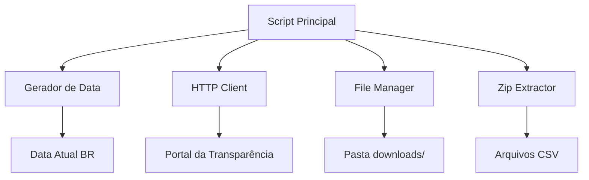

# Design Document

## Overview

O PEP Downloader Bot é uma aplicação Python que automatiza o download de arquivos de dados PEP (Pessoas Expostas Politicamente) do Portal da Transparência do Brasil. A aplicação utiliza requisições HTTP diretas para baixar arquivos .zip mensais, com funcionalidades opcionais de descompactação e tratamento robusto de erros.

## Architecture

### High-Level Architecture



### Core Components

1. **Date Generator**: Responsável por gerar o nome do arquivo baseado na data atual
2. **HTTP Client**: Gerencia requisições HTTP com headers apropriados
3. **File Manager**: Controla download e salvamento de arquivos
4. **Zip Extractor**: Opcional, extrai conteúdo dos arquivos .zip
5. **Console Logger**: Exibe progresso e status das operações

## Components and Interfaces

### DateGenerator Class

```python
class DateGenerator:
    def get_current_month_filename(self) -> str:
        """Gera nome do arquivo baseado na data atual (AAAAMM_PEP.zip)"""
        
    def get_brasilia_datetime(self) -> datetime:
        """Obtém data/hora atual no fuso de Brasília (-03)"""
```

### HTTPClient Class

```python
class HTTPClient:
    def __init__(self):
        self.session = requests.Session()
        self.headers = {
            'User-Agent': 'Mozilla/5.0 (Windows NT 10.0; Win64; x64) AppleWebKit/537.36'
        }
    
    def download_file(self, url: str, filepath: str) -> bool:
        """Baixa arquivo do URL especificado"""
```

### FileManager Class

```python
class FileManager:
    def __init__(self, download_dir: str = "downloads"):
        self.download_dir = download_dir
    
    def ensure_download_directory(self) -> None:
        """Cria diretório downloads se não existir"""
    
    def get_download_path(self, filename: str) -> str:
        """Retorna caminho completo para download"""
```

### ZipExtractor Class

```python
class ZipExtractor:
    def extract_zip(self, zip_path: str, extract_to: str) -> bool:
        """Extrai arquivos .zip com tratamento de erros"""
    
    def list_zip_contents(self, zip_path: str) -> List[str]:
        """Lista conteúdo do arquivo .zip"""
```

### ConsoleLogger Class

```python
class ConsoleLogger:
    def info(self, message: str) -> None:
        """Log de informações"""
    
    def success(self, message: str) -> None:
        """Log de sucesso"""
    
    def error(self, message: str) -> None:
        """Log de erros"""
```

## Data Models

### DownloadResult

```python
@dataclass
class DownloadResult:
    success: bool
    filename: str
    file_path: str
    file_size: int
    download_time: float
    error_message: Optional[str] = None
```

### ExtractionResult

```python
@dataclass
class ExtractionResult:
    success: bool
    extracted_files: List[str]
    extraction_path: str
    error_message: Optional[str] = None
```

## Error Handling

### HTTP Errors
- **Connection Timeout**: Retry com backoff exponencial (3 tentativas)
- **HTTP 404/403**: Log erro específico e interrompe execução
- **HTTP 500+**: Retry com delay progressivo
- **Network Errors**: Captura e log de exceções de rede

### File System Errors
- **Permission Denied**: Log erro e sugestão de solução
- **Disk Full**: Verificação de espaço antes do download
- **Path Not Found**: Criação automática de diretórios

### Zip Extraction Errors
- **Corrupted Zip**: Log erro e manutenção do arquivo original
- **Extraction Permission**: Tentativa com diferentes permissões
- **Invalid Zip Format**: Validação antes da extração

### Error Recovery Strategy
```python
def download_with_retry(url: str, max_retries: int = 3) -> DownloadResult:
    for attempt in range(max_retries):
        try:
            # Tentativa de download
            pass
        except requests.RequestException as e:
            if attempt == max_retries - 1:
                # Último retry falhou
                raise
            time.sleep(2 ** attempt)  # Backoff exponencial
```

## Testing Strategy

### Unit Tests
- **DateGenerator**: Testa geração de nomes com diferentes datas
- **HTTPClient**: Mock de requisições HTTP para testar headers e retries
- **FileManager**: Testa criação de diretórios e paths
- **ZipExtractor**: Testa extração com arquivos zip válidos e inválidos

### Integration Tests
- **End-to-End Download**: Teste completo do fluxo de download
- **File System Integration**: Testa operações reais de arquivo
- **Network Integration**: Testa com URLs reais (ambiente de teste)

### Test Data
- **Mock Zip Files**: Arquivos .zip pequenos para teste de extração
- **Mock HTTP Responses**: Respostas simuladas para diferentes cenários
- **Date Fixtures**: Datas específicas para testar geração de nomes

### Test Environment
```python
# pytest configuration
pytest_plugins = ["pytest_mock"]

# Test fixtures
@pytest.fixture
def temp_download_dir():
    with tempfile.TemporaryDirectory() as tmpdir:
        yield tmpdir

@pytest.fixture
def mock_http_response():
    return Mock(status_code=200, content=b"test zip content")
```

## Configuration

### Environment Variables
```python
# Configurações opcionais via variáveis de ambiente
DOWNLOAD_DIR = os.getenv('PEP_DOWNLOAD_DIR', 'downloads')
MAX_RETRIES = int(os.getenv('PEP_MAX_RETRIES', '3'))
EXTRACT_FILES = os.getenv('PEP_EXTRACT_FILES', 'true').lower() == 'true'
```

### Command Line Arguments
```python
parser = argparse.ArgumentParser()
parser.add_argument('--extract', action='store_true', help='Extrair arquivos ZIP')
parser.add_argument('--output-dir', default='downloads', help='Diretório de saída')
parser.add_argument('--verbose', action='store_true', help='Log detalhado')
```

## Security Considerations

### HTTP Security
- **User-Agent Rotation**: Diferentes user-agents para evitar detecção
- **Rate Limiting**: Delay entre requisições se necessário
- **SSL Verification**: Sempre verificar certificados SSL

### File Security
- **Path Traversal Protection**: Validação de nomes de arquivo extraídos
- **File Size Limits**: Limite máximo para downloads
- **Virus Scanning**: Opcional, integração com antivírus local

## Performance Optimizations

### Download Performance
- **Streaming Download**: Download em chunks para arquivos grandes
- **Progress Tracking**: Barra de progresso para downloads longos
- **Concurrent Downloads**: Suporte futuro para múltiplos arquivos

### Memory Management
- **Chunk Processing**: Processamento em pedaços para arquivos grandes
- **Resource Cleanup**: Context managers para garantir limpeza
- **Memory Monitoring**: Log de uso de memória em modo verbose